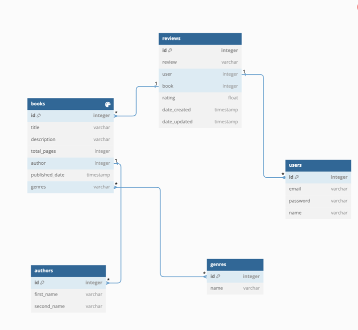

# Book Review Api

A Book Review API built using Django Rest Framework.

## Basic features

* Login through email
* Documentation using DRF Spectacular
* Dockerized for local development

## Technologies used

* Django Rest Framework
* PostgreSQL
* Docker
* Swagger

## ER Diagram



## Getting Started

Clone this repository to your local machine, enter it and run:

```
$ docker-compose up
$ docker-compose run --rm app sh -c "python manage.py createsuperuser" 
```

Navigate to http://0.0.0.0:8000/admin
